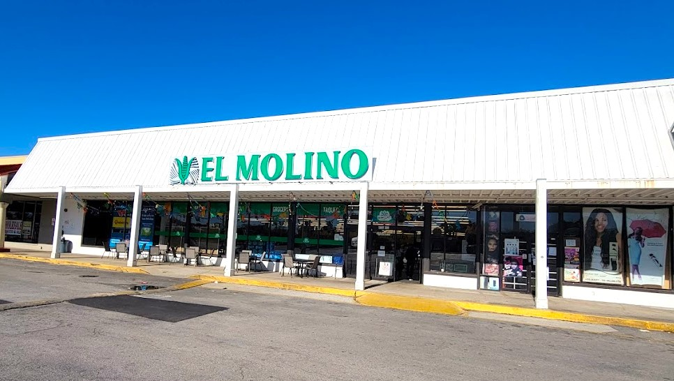

# El Molina - Authentic Mexican Restaurant & Grocery Website

## 🌮 Project Overview

El Molina is a modern, responsive website for an authentic Mexican restaurant and grocery store. The website showcases the restaurant's offerings, menu items, and grocery products in a visually appealing and user-friendly interface.

## ✨ Features

- **Modern, Responsive Design**: Mobile-friendly layout that works on all devices
- **Interactive UI Elements**: Smooth animations, hover effects, and transitions
- **Multiple Content Sections**:
  - Hero section with call-to-action buttons
  - About Us section highlighting the restaurant's story
  - Features section showcasing unique selling points
  - Menu specialties with visually appealing food cards
  - Customer testimonials with star ratings
  - Newsletter subscription form
  - Contact information with smooth-scroll navigation
- **E-commerce Ready**: Product cards for both menu and grocery items
- **Shopping Cart Functionality**: Add items to cart and manage orders

## 🛠️ Technology Stack

- **HTML5**: Semantic markup for better accessibility and SEO
- **CSS3**: Modern styling with variables, flexbox, and animations
- **JavaScript**: Interactive elements and cart functionality
- **Bootstrap 5**: Grid system and responsive components
- **Font Awesome**: Icon library for enhanced visual elements
- **Google Fonts**: Custom typography with Playfair Display and Poppins

## 📱 Pages

### Home Page
The landing page features an eye-catching hero image with overlay text and navigation to key sections. It highlights the restaurant's story, specialties, and customer testimonials.

### Menu Page
Displays the restaurant's offerings with beautiful food cards, prices, ratings, and the ability to add items to cart.

### Groceries Page
Showcases authentic Mexican grocery products available for purchase with image carousel and detailed product cards.

### Cart Page
Allows users to review selected items, adjust quantities, and proceed to checkout.

## 🎯 Key Design Elements

- **Color Palette**: Warm Mexican-inspired colors (rustic red, earthy green, golden yellow)
- **Typography**: Elegant Playfair Display for headings and readable Poppins for body text
- **Imagery**: High-quality food photography with consistent styling
- **Animations**: Subtle fade-in effects and hover states for interactive elements
- **Accessibility**: High contrast text, semantic HTML, and proper ARIA attributes

## 💻 Installation & Usage

1. Clone the repository:
